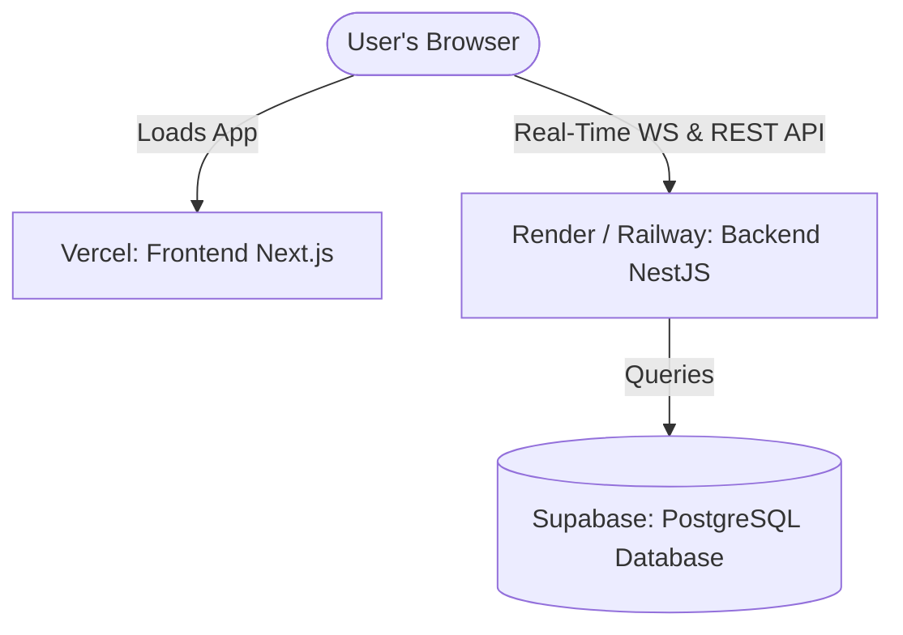

# 🚀 Deployment Guide: Element 5 Platform

This document describes how to deploy the **Element 5** platform (Next.js Frontend & NestJS Backend) to production.

---

## ❓ Can we deploy the entire project on Vercel?

**Short Answer**: You should deploy the **Frontend on Vercel**, but the **Backend (NestJS) on Render, Railway, or Heroku**.

### Why?
1. **WebSockets / Real-Time Voting**: The **StageVerse** voting terminal relies on live WebSockets (Socket.io) to transmit votes instantly. Vercel is a **serverless** platform. Serverless functions terminate after a few seconds and **do not support persistent WebSocket connections**.
2. **Server Lifecycle**: NestJS is built as a stateful, long-running server application. Running it as serverless functions on Vercel causes slow cold starts and connection limits on your database pool.

---

## 🗺️ Recommended Deployment Architecture

---

## 🎨 Part 1: Deploying the Database (Supabase)

1. Sign in to [Supabase](https://supabase.com/).
2. Create a new project. Keep note of the **Database Password**.
3. Go to **Project Settings** -> **Database**.
4. Retrieve the connection strings:
   * **Connection String (Transaction/Session)**: Used for `DATABASE_URL` (usually port `6543`).
   * **Connection String (Direct)**: Used for `DIRECT_URL` (usually port `5432`).
5. Open your SQL Editor in Supabase, copy the contents of the database schema script ([`backend/scripts/schema.sql`](file:///d:/All%20Project/element%20five%20website/Element5website/backend/scripts/schema.sql)), and run it to create tables, schemas, and initial test credentials.

---

## 💼 Part 2: Deploying the Backend (Render / Railway)

We recommend **Render** or **Railway** for NestJS because they support long-running processes and WebSockets out of the box.

### Deploying to Render
1. Go to [Render](https://render.com/) and create a new **Web Service**.
2. Connect your GitHub repository.
3. Configure the service settings:
   * **Root Directory**: `backend` (or leave blank if it's a dedicated repo).
   * **Runtime**: `Node`
   * **Build Command**: `npm install && npm run build`
   * **Start Command**: `npm run start:prod`
4. Go to the **Environment** tab and add your variables:
   * `DATABASE_URL` = *[Your Supabase Transaction URL]*
   * `DIRECT_URL` = *[Your Supabase Direct URL]*
   * `JWT_SECRET` = *[Generate a strong secret string]*
   * `PORT` = `4000`

Render will compile the TypeScript code and launch the NestJS API server. Copy the generated URL (e.g. `https://element5-backend.onrender.com`).

---

## 🎤 Part 3: Deploying the Frontend (Vercel)

1. Sign in to [Vercel](https://vercel.com/).
2. Click **Add New** -> **Project**.
3. Select your repository.
4. In the configuration settings:
   * **Framework Preset**: `Next.js`
   * **Root Directory**: `Element5website` (or leave empty if it's the main repo).
5. Open **Environment Variables** and add:
   * `NEXT_PUBLIC_API_URL` = *[The URL of your deployed NestJS backend, e.g., `https://element5-backend.onrender.com`]*
6. Click **Deploy**.

Vercel will build the Next.js pages and publish them to a production-ready domain.

---

## 🧪 Post-Deployment Checklists

1. **CORS Security**: Ensure your backend CORS configuration permits requests from your frontend Vercel URL.
2. **WebSocket Handshakes**: Navigate to the live `/stageverse` page, open your browser's Developer Tools Console, and confirm that there are no connection errors or failed WebSocket handshakes.
